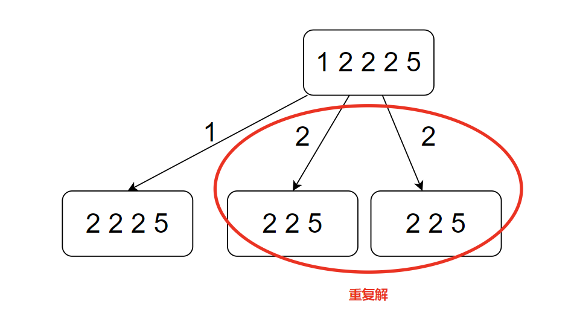

# 题目名

## 题目描述


## 方法一：


**思路：**

1. 


**源代码：**

```cpp
```


**注意点：**

1. 注意数组内有重复元素时，出现重复解的情况
2. 为了避免重复解，应该在解空间树的每层进行判断，即 for 循环内
3. 如果元素与上一个元素相同，continue




## 方法二：


**思路：**

1. 


**源代码：**

```cpp

```


**注意点：**

1. 


