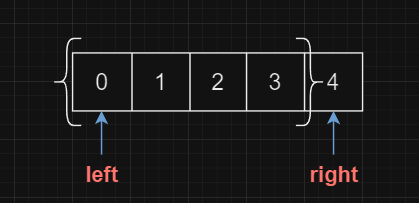
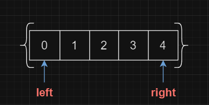

# 关于边界情况的一点思考


这两天发现新上手一个算法时，搞清楚其思路并不难，难点往往在于边界情况的处理

比如对于“双指针法”，指针重合的情况是否需要考虑？指针在循环后指向的元素是否需要判断？

对此类边界情况的讨论，有一些简单的思路来辅助判断，开闭区间以及循环前后


## 开闭区间

1. 什么是区间的开闭？区间开闭的本质是什么？
2. 为什么区间开闭是判断边界情况的本质？


指针只能指向数组中的某个值，但是，指针所指向的值是否被处理是不确定的

因此，需要 **明确** 每个指针指向的值，是否处于定义范围内，即

- 左闭右开区间：
  - 
  - 右指针指向值不在定义范围内
- 左闭右闭区间：
  - 
  - 右指针指向值在定义范围内

由此，可以判断出左右指针是否可以重合的问题

如：二分查找中，什么时候结束循环

```cpp
vector<int>::size_type lef = 0, rig = nums.size(); // 定义为左闭右开区间，所以 rig = nums.size()

        while(lef < rig) {
        // 如果定义为 lef <= rig 那么在本次循环中，lef 将访问定义外的值
        }
```


## 循环前后


1. 对于一个循环而言，它的判断条件前后都发生了什么？
2. 这对条件的判断有什么影响？
3. 如何利用*循环前后来判断*循环条件产生的边界问题


在每个循环中，对于判断条件而言，需要知道在**判断前，哪些值发生了变化**，以及在**判断后，变化的值会产生什么影响**

如：有序数组的平方

```cpp
// 在本次循环开始前
// 由于上次循环中lef与rig所指数值先加入了result数组
// 然后才lef++ rig--
// 因此，循环开始前，lef与rig所指的数值没有加入数组
	// 当lef == rig时，lef与rig所指的数值还未加入数组
	// 因此需要lef >= rig的条件
while(lef <= rig) {
// 本次循环，将lef或rig所指的数值加入到数组
    if(nums[lef] * nums[lef] > nums[rig] * nums[rig]) {
        result[k--] = nums[lef] * nums[lef];
        lef++; 
        // 此时lef指向数值没有在数组中
    } else {
        result[k--] = nums[rig] * nums[rig];
        rig--;
        // 此时rig指向数值没有在数组中
    }
}
```


如：长度最小的子数组

```cpp
while(fast < nums.size()) {
        // 左闭右开
        sum += nums[fast++];
    
    	// 为什么是大于等于而不是大于？
    		// 因为sum 始终是 滑动窗口内数值的和
    		// 因此，当sum等于target时，当前窗口 也满足 要求，长度需要被记录
        while(sum >= target) {
            // sum == target时长度被记录
            result = result < fast - slow ? result : fast - slow;
            sum -= nums[slow++];
        }
    }
```


