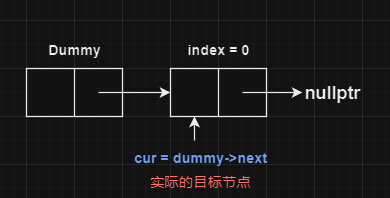
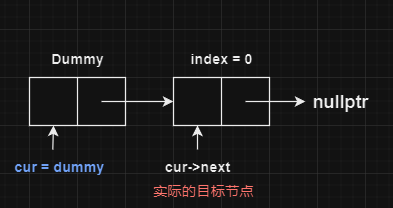

# 单链表中dummy节点设定cur指针初始值的问题


单链表相关算法经常会使用虚拟头结点简化判断，并使用一个指针`cur`跟踪当前节点。

但是引入虚拟头结点后，对索引的判断会有一定的影响。

尤其是关于`cur`初始值是`dummy`还是`dummy->next`，

以及取不同值之后，最后需要操作的节点是`cur`还是`cur->next`的问题。

对于这个问题，关键点在于使用虚拟头结点的函数**对目标节点的要求**。


## 第一种：直接使用目标索引节点：

比如单链表操作中的`get(index)`:

```cpp
int get(int index) {
        if (index < 0 || index > length-1) {
            return -1;
        }

        Node* dummy = new Node(0, head);
        Node* cur = dummy->next;
        for(int i = 0; i < index; i++) {
            cur = cur->next;
            // i是cur当前所在索引
        }
        
        delete dummy;
        return cur->val;
    }
```

由于`get(index)`中，一旦查找到了目标节点，可以直接获取**本节点**内的值。

因此，将`cur`初始值设置为`dummy->next`，可以使`cur`**始终指向**当前执行到的节点：



最后对目标节点操作时，使用`cur`就是目标节点


## 第二种：需要使用目标索引节点之前的节点：

比如 707.设计链表 中的`addAtIndex()`：

```cpp
void addAtIndex(int index, int val) {
        // 由于单链表只能从前向后访问
        // 只有查找到下一个节点为index时
        // 能够插入新节点
        // 所以是cur->next
        if (index < 0 || index > length) {
            // 不同于 get(), index 可以等于length，此时添加到末尾
            return;
        }

        Node* dummy = new Node(0, head);
        Node* cur = dummy;
        for(int i = 0; i < index; i++) {
            cur = cur->next;
            // i是cur->next所在索引
        }
    	// 也可以直接使用index移动cur
        // while(index--) {
        //     cur = cur->next;
        // }
        
        Node *tmp = cur->next;
        cur->next = new Node(val);
        length++;
        cur->next->next = tmp;

        head = dummy->next;
        delete dummy;
    }
```

由于`addAtIndex()`函数要求在目标索引节点**之前**添加新节点，需要**使用目标索引节点的前一个节点来操作**

如果`cur`直接指向目标索引节点，无法获取到之前节点的地址，也就无法完成操作。

因此，可以使`cur`指向目标索引节点的前一个节点，使用`cur->next`来访问目标索引节点。

此时`cur`的值为索引值-1，

那么初始化时，应该使用`cur = dummy`，（`dummy`节点可以看做-1）：




最后对目标节点操作时，`cur->next`才是目标节点


## 总结

`cur`的值是设定为`dummy`？还是设定为`dummy->next`？

取决于最后要操作的节点可使用的操作方式。

- 如果一个函数只用对当前节点操作
  - 那么将`cur`初始值设置为`dummy->next`
  - 最后获得的目标节点的指针就是`cur`本身
- 如果必须使用目标节点的前一个节点进行操作
  - 那么将`cur`初始值设置为`dummy`
  - 最后获得的目标节点的指针是`cur->next`


以上方式只使用虚拟节点结合指针时一种简单的判断方式。实际情况中，还有其他办法可以使用比如同时使用`pre`和`cur`节点
