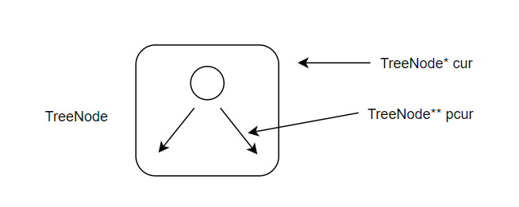

使用二级指针免去使用指针保存父节点以及判断左右子节点

示例：

```cpp
class Solution {
public:
    TreeNode* insertIntoBST(TreeNode* root, int val) {
        TreeNode** pcur = &root;
        while (*pcur != nullptr) {
            if ((*pcur)->val > val)
                pcur = &((*pcur)->left);
            else
                pcur = &((*pcur)->right);
        }
        *pcur = new TreeNode(val);

        return root;
    }
};
```

- `TreeNode* cur` 是一个指向 `TreeNode` 指针，保存 `TreeNode` 的内存地址
- `TreeNode** pcur` 是一个指向 `TreeNode*` 指针，保存 `TreeNode*` 的内存地址