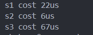
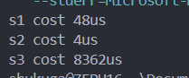
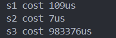
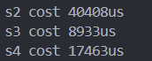
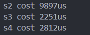
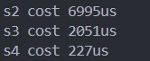
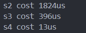

测试代码

```cpp
#include <chrono>
using namespace chrono;

auto start = high_resolution_clock::now();
// 调用需要测量的函数
s1.climbStairs(20);
// 获取结束时间
auto end = high_resolution_clock::now();
// 计算时间差，单位是微秒
auto duration = duration_cast<microseconds>(end - start);
cout << "s1 cost " << duration.count() << "us" << '\n';
```


使用题目为 70. 爬台阶

- s1 记忆化回溯
- s2 动态规划
- s3 暴力回溯


1. n = 20 时



2. n = 30 时



3. n = 40 时



对于 70. 爬台阶，可以看出记忆化回溯尽管只计算需要的子结构，但由于栈的开销，在时间上没有优势。

但是对于 416. 分割等和子集

- s1 暴力回溯，时间过长
- s2 二位数组动态规划
- s3 一维数组动态规划
- s4 记忆化回溯

1. `vector<int> nums(1000, 1); `



2. `vector<int> nums(500, 1);`

   

3. `vector<int> nums(100, 20);`

   

4. `vector<int> nums(20, 100);`



结论：

虽然记忆化回溯和动态规划的时间复杂度都是 `O(n*sum)` 级别的，但是由于记忆化回溯时间上有 `O(n)` 级别的栈开销，因此 n 足够大时，记忆化回溯慢于动态规划。当 `n*sum` 足够大时，由于动态规划计算了太多与结果无关的子结构结果，此时动态规划又慢于记忆化回溯。

注意到输入用例 3 和输入用例 4，`n*sum` 相等。但是由于记忆化回溯的时间消耗与栈开销相关，而栈时间消耗只与 n 相关。因此虽然状态数组大小相同，记忆化回溯的时间大大缩短了。 
